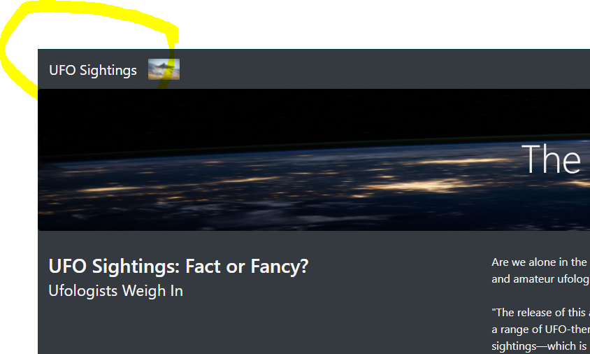

# UFOs

## Overview of the analysis
The purpose of this project is to is to building a dynamic webpage that allows users to enter different criteria to get more information regarding UFO sightings. The page then dynamically updates with the data entered by the user’s filters. The filters pull data from a table with UFO sightings data and can be sliced in many for example by: event date, city, state, country or shape.

## Results: 
How to use the new webpage and the search criteria 
o    Users can filter the website using 5 different filters listed below

1.	Date (of sighting)
2.	City
3. 	State
4.	Country
5. 	Shape 

###
Here are a few screenshots showing the filtering options as they are on the website

## Summary - Recommendations

1.   An area for improvement is when it comes to filters. The user needs to know exactly what they're looking for withing the available filters. They also need to know how to spell it correctly, otherwise it will not show up. 
2.   One way to improve this design would be to create a dropdown, multi-selectable list that would allow users to click and choose whatever they're looking for.
3.   Once, data is entered into the search criteria, there is no easy way to clear that input. Another area for improvement would be to create a "Clear Search" button that clears the searches easily
